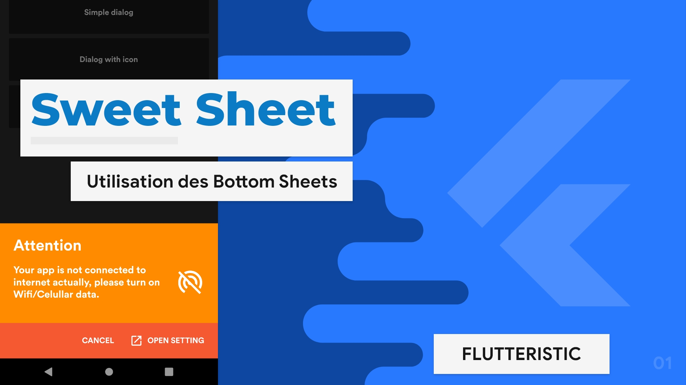

# Sweet Sheet

Utilisation des feuilles de fond (Bottom Sheet)

`Les Bottom Sheet sont des surfaces contenant du contenu supplémentaire ancré au bas de l'écran.`

Tutoriel écrit disponible sur le [site de flutteristic](https://flutteristic.dev/docs/tutoriels/Sweet%20Sheet.html)